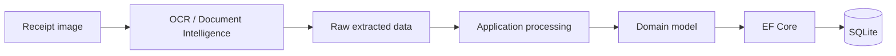
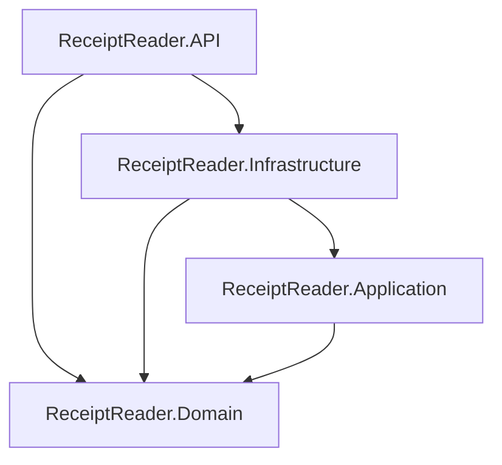

# ReceiptReader

ReceiptReader is a .NET Web API for extracting structured data from receipts.

The project explores the complete flow from unstructured receipt input through OCR and domain modelling to persistence and further analysis.

## Overview

ReceiptReader processes receipt data through several stages:



The project is structured as a layered .NET solution:



## Current functionality

- ASP.NET Core Web API
- Receipt data extraction using Azure AI Document Intelligence
- OCR support using Tesseract
- Domain modelling and validation of receipt data
- Entity Framework Core persistence
- SQLite database for local development
- Analysis logging to avoid unnecessary re-processing
- Automated domain and infrastructure tests
- Result-based error handling

Receipt parsing and extraction are still being developed and are not intended to handle every receipt format.

## Technology

| Area | Technology |
| --- | --- |
| Language | C# |
| Runtime | .NET 10 |
| API | ASP.NET Core |
| Persistence | Entity Framework Core |
| Database | SQLite |
| Cloud OCR | Azure AI Document Intelligence |
| Local OCR | Tesseract |
| Testing | xUnit v3 |
| Mocking | Moq |
| Architecture | Layered / Clean Architecture principles |

## Solution structure

```text
ReceiptReader
├── src
│   ├── ReceiptReader.API
│   ├── ReceiptReader.Application
│   ├── ReceiptReader.Domain
│   └── ReceiptReader.Infrastructure
│
└── tests
    ├── ReceiptReader.Domain.Tests
    └── ReceiptReader.Infrastructure.Tests
```

### ReceiptReader.API

Application entry point, HTTP endpoints and dependency configuration.

### ReceiptReader.Application

Application-level workflows and abstractions.

### ReceiptReader.Domain

Core receipt entities, validation rules and domain behaviour.

### ReceiptReader.Infrastructure

Implementations for persistence, OCR services and other external dependencies.

## Getting started

### Requirements

- .NET 10 SDK
- Azure AI Document Intelligence resource if using the Azure extraction provider

Clone the repository:

```bash
git clone https://github.com/Timiman1/ReceiptReader.git
cd ReceiptReader
```

Restore dependencies:

```bash
dotnet restore ReceiptReader.sln
```

## Configuration

The API project uses .NET User Secrets for sensitive local configuration.

Initialize User Secrets if needed:

```bash
dotnet user-secrets init --project src/ReceiptReader.API
```

Set the Azure Document Intelligence API key:

```bash
dotnet user-secrets set \
  "RawTextExtractionProviders:AzureAIDocumentIntelligence:ApiKey" \
  "YOUR_API_KEY" \
  --project src/ReceiptReader.API
```

Sensitive credentials should not be stored in `appsettings.json` or committed to source control.

## Database

ReceiptReader uses SQLite for local persistence through Entity Framework Core.

To apply EF Core migrations:

```bash
dotnet ef database update \
  --project src/ReceiptReader.Infrastructure \
  --startup-project src/ReceiptReader.API
```

## Run the API

From the repository root:

```bash
dotnet run --project src/ReceiptReader.API
```

## Tests

Run all automated tests:

```bash
dotnet test ReceiptReader.sln
```

The current test suite covers domain validation and infrastructure behaviour.

At the time of writing, the solution contains **63 passing automated tests**.

## Design goals

ReceiptReader is primarily a learning and experimentation project focused on:

- modelling financial data with explicit domain rules
- separating domain logic from infrastructure concerns
- integrating external document-processing services
- transforming unstructured input into structured data
- testing domain behaviour
- building a maintainable .NET solution

## Current limitations

- Receipt parsing is still under development
- Different receipt layouts may require additional parsing logic
- Azure Document Intelligence requires external service configuration
- The API is currently intended primarily for local development and experimentation

## Possible next steps

- improve extraction and parsing across different receipt formats
- expand integration testing
- expose more structured receipt analysis through the API
- add automated CI for build and tests
- explore aggregation and analytics over extracted receipt data

## License

This project is licensed under the MIT License. See [LICENSE](LICENSE).